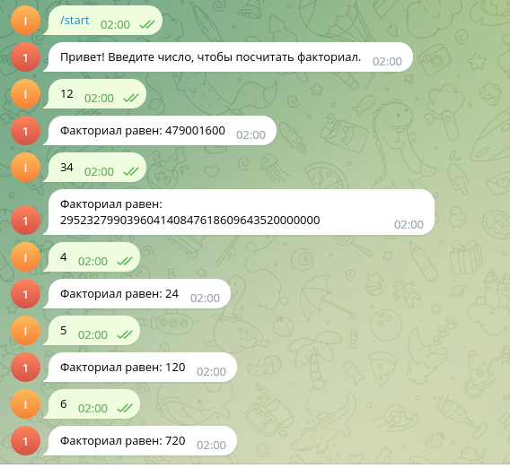

# Телеграмм бот для вычисления факториала.

### Использованы:
- Python
- python-telegram-bot
***
##  Запуск
### команда на линукс:
    docker compose up 

бот https://t.me/pythontest199_bot

Пример работы

  

